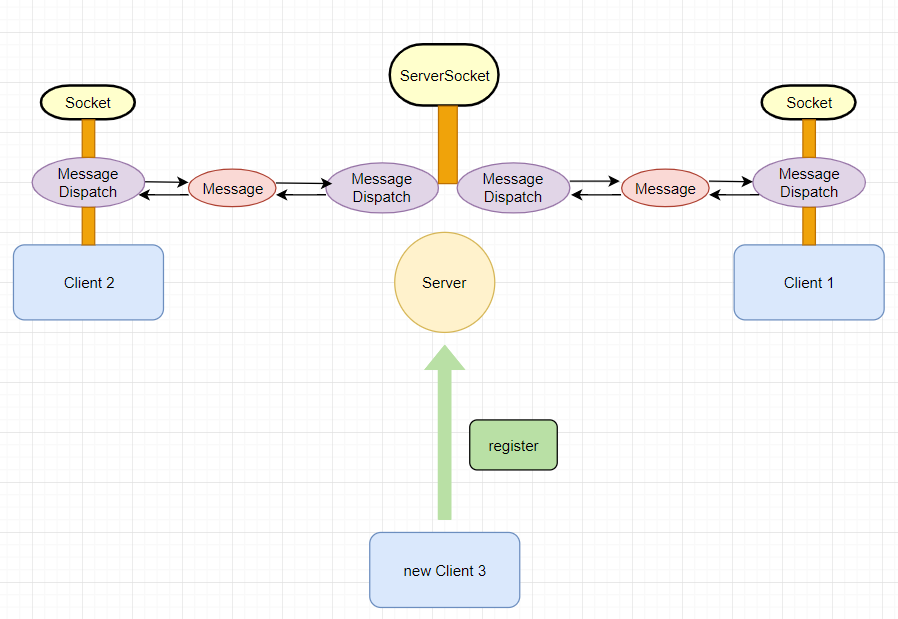

c/s structure communication demo.

 

服务端采用了 ServerSocket 类监听Socket连接，客户端采用了Socket类进行通信。每个客户端都有一个MessageDispatch 用于发送和接受消息，MessageDispatch 主要是对Socket类进行封装，对socket的输入输出流进行处理，并生成传输的Message。Message是我们传输的消息的一个封装，包括了消息的发送方，接受方和消息内容。当新注册一个用户时，会在客户端生成一个MessageDispatch 用于收发消息，同时在服务端也用生成一个MessageDispatch用于同该客户端通信。

功能：1.使用@与其他客户端聊天，使用@admin与服务端通信

2.注销功能，使用@admin logout